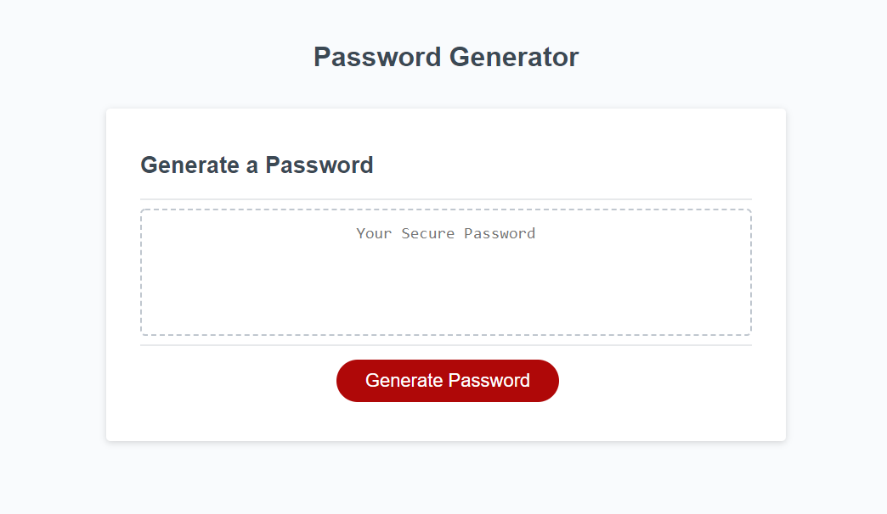

# Password Generator

## Description

This project is a random password generator that creates a password based upon specifications determined by user responses to prompts. It was created using HTML, CSS, and Javascript.

The password size must be between **8** and **128** characters, and if no response is provided, or if the response is outside of that range, it displays an **alert** displaying the requirements and returns the user to the number of characters prompt.

The user can also **cancel** the application at the number of characters prompt, which stops any further prompts.

Once a valid number is entered, it then requires that the user select **at least one of four types of characters** to be included in the password. These options are: lowercase letters, uppercase letters, numbers, and/or special characters. Not selecting any will display an **alert** and return the user to the character type prompts.

Once valid selections have been made, the app returns a password consisting of the user specified number of random characters from all of the options selected.

The app can be run multiple times *without refreshing the page*, and will replace the prior displayed password with the new one that is generated.

## Page Link
The project can be viewed at <https://tharveyster.github.io/password_generator/>.

## Screenshot

## License
Copyright 2021 Todd Harvey

Permission is hereby granted, free of charge, to any person obtaining a copy of this software and associated documentation files (the "Software"), to deal in the Software without restriction, including without limitation the rights to use, copy, modify, merge, publish, distribute, sublicense, and/or sell copies of the Software, and to permit persons to whom the Software is furnished to do so, subject to the following conditions:

The above copyright notice and this permission notice shall be included in all copies or substantial portions of the Software.

THE SOFTWARE IS PROVIDED "AS IS", WITHOUT WARRANTY OF ANY KIND, EXPRESS OR IMPLIED, INCLUDING BUT NOT LIMITED TO THE WARRANTIES OF MERCHANTABILITY, FITNESS FOR A PARTICULAR PURPOSE AND NONINFRINGEMENT. IN NO EVENT SHALL THE AUTHORS OR COPYRIGHT HOLDERS BE LIABLE FOR ANY CLAIM, DAMAGES OR OTHER LIABILITY, WHETHER IN AN ACTION OF CONTRACT, TORT OR OTHERWISE, ARISING FROM, OUT OF OR IN CONNECTION WITH THE SOFTWARE OR THE USE OR OTHER DEALINGS IN THE SOFTWARE.

## Contact Info
Email: todd@theharveysplace.com
